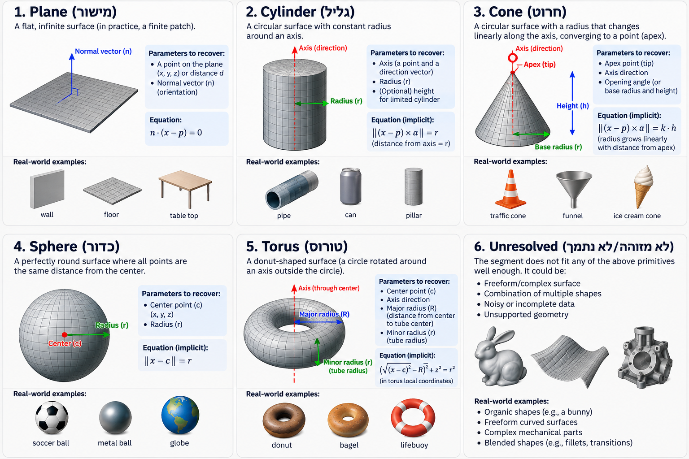

# fitpipeline: segment classification and primitive fitting

[עברית](README.he.md)

Classifies every supplied mesh segment as a `plane`, `cylinder`, `cone`, `sphere`, `torus` or `unresolved`, fits the chosen primitive, and writes `predictions.json`. The assignment is in [`assignment/README.md`](assignment/README.md) and the data format is in [`assignment/DATA_FORMAT.md`](assignment/DATA_FORMAT.md).

## Running it

Requirements: Python 3.12 and [uv](https://docs.astral.sh/uv/). The runtime dependencies are NumPy and SciPy, and pytest is used for the tests. Exact versions are pinned in `uv.lock`.

```bash
uv sync                                               # create .venv with the pinned dependencies
uv run python -m fitpipeline assignment/data predictions.json
uv run pytest                                         # 266 checks, about 35 s
```

The command reads all 10 meshes, prints one table row per segment, and writes `predictions.json` (committed in this repository). It runs in about 2.3 s on one CPU core. The output is deterministic because nothing is random, so repeated runs produce byte-identical files. Useful flags:

- `-v`: print each segment's reason and fitted parameters.
- `--mesh mesh_09 --segment 0`: filter the printed table (the file always covers everything).
- `--no-write`, `-q`.

To inspect one segment's seeds and final decision, run `uv run python view.py mesh_08 0`.

Without uv, `pip install -e .` followed by `python -m fitpipeline ...` works as well.

## Results on the supplied data

| Result | Count | Segments |
|---|---|---|
| plane | 33 | all flat faces |
| cylinder | 5 | mesh_02/0, mesh_05/0, mesh_05/1, mesh_06/4, mesh_07/6 |
| cone | 1 | mesh_03/0 |
| sphere | 1 | mesh_04/0 |
| torus | 1 | mesh_08/0 |
| unresolved | 2 | mesh_09/0 (ellipsoid), mesh_10/1 (freeform) |

Every accepted fit has status `fitted`, and its vertices lie on the fitted surface to within about 1e-7 of the segment size. That is the float32 precision of the supplied coordinates. The recovered parameters are round numbers:

- cylinders of radius 1, 2 and 4 along z;
- a cone with apex (0, 0, 6), axis −z and half angle atan(1/4) (a frustum with radii 2 → 1 over height 4);
- a unit sphere;
- a torus with R = 4 and r = 1.25 about a tilted axis.

The two `unresolved` segments:

- **mesh_09/0** lies on an ellipsoid with semi-axes 4, 2.5 and 1.5 (general-quadric residual 3e-8). Arbitrary quadrics are explicitly not supported, so it is rejected, and the reason names the ellipsoid.
- **mesh_10/1** does not fit any supported primitive or any general quadric (residuals of 10–30 % of its size), so it is treated as freeform.

## Method

Pipeline: `loader` → `geometry` (normalize) → `hypotheses` (closed-form seeds) → `refinement` (SciPy) → `classifier` (accept/reject, pick one) → `predictions` (JSON). One module per stage lives in `src/fitpipeline/`.

### 1. Samples and normalization (`geometry.py`)

Each segment is translated to its area-weighted centroid and scaled so that its RMS extent is 1. All numerics and tolerances run in this frame, which makes them independent of position, units and orientation. Results are mapped back to the input frame at the end.

The pipeline uses two sample sets, both weighted by area so that uneven tessellation does not bias anything:

- **Vertices**, each weighted by one third of the area of its incident triangles. For a clean tessellation the vertices lie *on* the true surface, so they are the positional samples.
- **Facet centroids with facet normals**, weighted by triangle area. These are used for orientation (Gauss-map) reasoning.

### 2. Closed-form seeds (`hypotheses.py`)

For each of the five types there is a deterministic, non-iterative guess:

| Type | Seed |
|---|---|
| plane | weighted PCA of the vertices |
| sphere | algebraic (linear) sphere fit |
| cylinder | axis = weakest principal direction of the facet normals (they lie on a great circle); radius and axis point from a circle fit in the perpendicular plane |
| cone | axis from the mean-centred normals (they lie on a small circle); apex = least-squares intersection of all tangent planes; half angle from the vertices given apex and axis |
| torus | the normal lines of a surface of revolution all meet the axis, which is linear in Plücker coordinates; then a circle fit in the (radial, axial) profile gives both radii and the centre |

A seed is skipped when it is degenerate for the segment, for example no cylinder for a flat segment.

### 3. Fitting objective (`refinement.py`)

Each seed is refined with `scipy.optimize.least_squares` (trust-region reflective). The objective is the area-weighted **signed geometric vertex-to-surface distance**, $\sum_i w_i\,\rho\big(d_\text{signed}(x_i;\theta)\big)$. Details:

- **Robust loss:** `soft_l1` with scale 0.01 of the segment extent, so a few stray vertices cannot drag the fit.
- **Signed distances:** the absolute distance has a kink at the surface that breaks the finite-difference Jacobian near zero residual, so the solver uses signed distances.
- **Minimal parameters:** each primitive is parametrized minimally around its seed, so the optimizer has no redundant freedom to wander in:
  - directions are tilted by two angles, so they stay unit length;
  - a cylinder axis point only slides across the axis;
  - radii and the cone half angle are bounded.
- **Budget:** at most 200 function evaluations, with tolerances of 1e-12.

Every type is refined, not only the likely one. Comparing refined residuals is what makes the classification fair.

### 4. Classification and acceptance criteria (`classifier.py`)

A refined candidate is **accepted** only if all of these hold:

| Check | Threshold |
|---|---|
| area-weighted RMS vertex distance | ≤ 1e-3 × segment RMS extent |
| largest vertex distance | ≤ 1e-2 × segment RMS extent |
| RMS angle between facet normals and the fitted surface normal | ≤ max(0.5°, ½ × largest dihedral angle inside the segment) |
| vertices, for a curved type | ≥ degrees of freedom + 3 |
| radii | ≤ 1000 × segment extent (otherwise the surface is indistinguishable from a plane) |

The normal check is essential. The vertices of a coarse cylinder that has only two rings (mesh_05's thin walls) also lie *exactly* on a sphere, and only the facet normals can separate the two. A flat facet inscribed in a curved surface is tilted by up to half the angle between neighbouring facets, so the bound on the normal error scales with the segment's own tessellation.

**Choosing among accepted candidates:** a plane is a limit of a huge sphere, and a cylinder is a limit of a cone, so several types often pass. Candidates are ordered by number of parameters: plane (3) < sphere (4) < cylinder (5) < cone (6) < torus (7). A more general type replaces the current choice only if it reduces the normal error to below 80 % of the current value and by at least 0.005°. The simplest adequate primitive therefore wins.

**No candidate accepted → `unresolved`.** The closest attempt is named in the reason. A general quadric $x^\top A x + b\cdot x + d = 0$ is then fitted to the vertices (`quadric.py`, scored by Sampson distance) to explain the rejection:

- **Unsupported quadric:** if the vertices lie on it, the reason says which one, for example "an ellipsoid with semi-axes 4, 2.5, 1.5".
- **Freeform:** otherwise the surface is reported as freeform.

This diagnostic never turns a segment into a primitive.

### 5. Output (`predictions.py`)

- **`fit.status`:**
  - `fitted`: accepted, and the optimizer stopped on a tolerance.
  - `partial`: accepted, but the optimizer hit its evaluation budget.
  - `failed`: every `unresolved` segment. The fit was attempted, and `notes` names the closest type. Its parameters are withheld (`null`) because they do not follow the geometry.
  - `not_applicable` is never used, because a fit is always attempted.
- **`fit.residual`:**
  - `vertex_rms_distance` and `vertex_max_distance` are in input length units, over the segment's vertices; the RMS is weighted by vertex area.
  - `relative_vertex_rms` is the same RMS divided by the segment's RMS extent.
  - `facet_normal_rms_degrees` is the area-weighted RMS angle between facet normals and the fitted surface normal at the facet centroids.
- **Validation:** before writing, the file is checked for exactly one entry per `(mesh_id, segment_id)`, valid enums, finite numbers and consistent `kind`/`primitive_type`.

### Parameter conventions



The overview is illustrative. The exact fields reported are in the table below. For example, the cone is reported by its half angle rather than by base radius and height, and no finite height is reported for cylinders or cones.

These follow the suggested names in `DATA_FORMAT.md`, in the input frame and units:

| Type | Parameters | Notes |
|---|---|---|
| plane | `point`, `normal` | `point` is the area centroid projected onto the plane; `normal` follows the triangle winding |
| cylinder | `axis_point`, `axis_direction`, `radius` | `axis_point` is the axis point nearest the segment's centroid; sign of the direction is arbitrary |
| cone | `apex`, `axis_direction`, `half_angle_radians` | axis points from the apex toward the segment; angle in (0, π/2) |
| sphere | `center`, `radius` | |
| torus | `center`, `axis_direction`, `major_radius`, `minor_radius` | sign of the direction is arbitrary |

### What confidence means

`confidence` is a heuristic score in [0, 1], not a calibrated probability.

- **For a primitive** it is the product of three factors:
  - **position margin:** how far below tolerance the vertex residual is, on a log scale;
  - **evidence:** the vertex count relative to the number of free parameters;
  - **separation:** 1 when no non-nested rival type is also accepted. It falls when a rival explains the normals almost as well, which is why mesh_05/0 scores 0.75, since a sphere also fits its vertices.
- **For `unresolved`** it grows from 0.5 with how badly the closest candidate misses its tolerance, on a log scale. It is 0.5 when the rejection is for missing evidence (too few vertices, zero area) rather than a bad residual.

On this clean synthetic data almost every primitive scores 0.99, because the residuals sit at float precision.

## How specific difficulties are handled

- **Ambiguity:** nested types (a plane inside a sphere, a cylinder inside a cone) are resolved by simplest-type-wins with a margin. Non-nested look-alikes (a sphere and a coarse cylinder) are separated by facet normals and lower the confidence.
- **Uneven triangle sizes:** every average is area-weighted. A test regrades a triangulation so that triangle sizes vary by about 10× and checks that the answer does not change.
- **Partial surfaces:** all fits use infinite surfaces and need no closed boundary. Arcs, frusta and torus patches fit like complete ones, and there are tests on partial primitives.
- **Numerical failures:** degenerate seeds are skipped per type. A refinement that throws or returns non-finite values keeps its seed or drops that type. Segments with zero area or too few vertices become `unresolved` with the reason "insufficient evidence" and never raise an exception. Output is checked for NaN and Inf before writing.
- **Tessellation error:** vertex residuals are measured on vertices, which lie on the true surface, and the normal tolerance is derived from the segment's own dihedral angles.

## Focused checks (`tests/`, 266 tests)

- **Pose and scale invariance:** every primitive is classified correctly, with confidence above 0.9, under a random rotation with scale 0.01, and again under a translation to 1e6 from the origin. Residuals and confidences do not depend on pose.
- **Poor-fit rejection:**
  - a freeform bumpy sheet is `unresolved` under every pose, and its reason says no quadric fits;
  - an ellipsoid patch is `unresolved`, with its semi-axes named correctly;
  - a sphere with a bump is rejected;
  - wrong types stay poor fits after refinement.
- **The coarse-cylinder trap:** a two-ring cylinder whose vertices lie exactly on a sphere is still classified as a cylinder.
- **Recovery:** known parameters are recovered for all five types on synthetic partial surfaces, and for the supplied cylinder, cone, sphere and torus. Refinement converges from perturbed seeds and removes the torus seed bias.
- **Robustness:** a robust loss against outlier vertices, uneven triangle sizes, a single triangle, zero-area and non-finite input, and precision far from the origin.
- **Reproducibility and schema:** the output is bitwise repeatable and valid, strict JSON, and the CLI behaviour is tested.

## Implemented versus reused

- **Implemented here:** everything in `src/fitpipeline/` and `tests/`: the loader, normalization, the closed-form seeds, the minimal parametrizations, distance and normal functions, acceptance rules, the quadric diagnostic, the confidence score, the JSON writer and the CLI.
- **Reused:** NumPy for linear algebra (`eigh`, `svd`, `lstsq`), `scipy.optimize.least_squares` for the nonlinear solve, and pytest.
- **Not used:** CGAL, Open3D, trimesh, and any machine learning or network access.
- **AI assistance:** the code was written with the help of an AI coding assistant (Claude Code). The pipeline makes no AI or network calls at runtime.

## Limitations and unfinished work

- **Tolerances assume clean data.** 1e-3 of the segment extent is right for these exact synthetic tessellations. On a noisy scan almost every curved segment would come out `unresolved`, and the thresholds would need to adapt to a measured noise level. That was not built.
- **One seed per type.** There is no multi-start or RANSAC. A bad closed-form seed on a hard segment (a tiny torus patch, a cone with a nearly zero half angle) could converge to a local minimum and be rejected. CGAL Efficient RANSAC was planned as an optional seeder but was not needed on this data, so it was not built.
- **The normal bound uses the single largest dihedral angle.** One sharp crease inside a segment would loosen it for the whole segment, although the vertex tolerance still applies.
- **Confidence is not calibrated.** There is no labelled data to calibrate it against.
- **The quadric diagnostic only explains a rejection.** Ellipsoids and hyperboloids are recognized but never reported as primitives, because that is outside the supported types.
- **No visual inspection tool.** A Plotly HTML report was planned. `view.py` gives a console view instead.

## Time spent

About 5 hours of implementation, judging by the commit history (2026-09-30, 11:20–16:20), plus planning and write-up.

## Repository layout

```
src/fitpipeline/   loader, geometry, primitives, hypotheses, refinement, classifier, quadric, predictions, report, CLI
tests/             pytest suite (synthetic primitives in tests/synthetic.py)
predictions.json   the submitted output
view.py            per-segment console inspector
explanations/      stage-by-stage write-ups in English (en/) and Hebrew (he/)
docs/images/       figures used by the READMEs
MVP_SPEC.md        the pre-implementation plan
```
